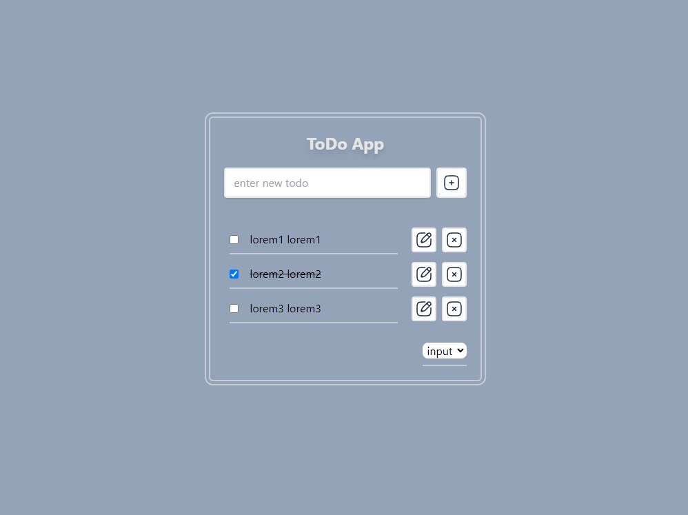

# todo-app

> app that allows users to view/add/edit/delete and sort tasks they want to work on, and also mark tasks as complete.<br/>

> todo-app (work in progress..) - [_click_](https://github.com/har-y/todo-app). <br/>
> project menagment - [_click_](https://trello.com/b/aS9HtQPf/todo-app).

## Screenshots



## Technologies

`Vite`
`ReactJS`
`JavaScript`
`Tailwind`

## Setup

> **instructions**

**first clone this repository.**

```
$ git clone https://github.com/har-y/todo-app.git
```

**install dependencies. make sure you already have [`nodejs`](https://nodejs.org/en/) & [`npm`](https://www.npmjs.com/) installed in your system.**

```
$ npm install or yarn
```

**run it**

```
$ npm run dev or yarn run dev
```
